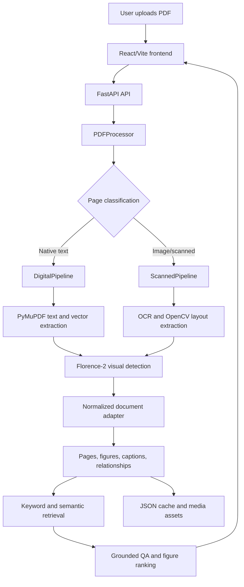

# Smart Book Reader

Smart Book Reader is a document-intelligence application for textbooks, papers, and scanned PDFs. It extracts text and visual regions, builds a normalized document graph, supports grounded question answering, and presents the result through a React interface.

## Product Architecture



### Runtime boundaries

1. **Frontend**: `frontend/src/main.jsx` uploads PDFs, browses normalized pages, displays figures, renders answers, and downloads cleaned full text.
2. **API**: `api/main.py` owns HTTP routes, upload handling, cache loading, public media URLs, and question requests.
3. **Processing**: `src/pdf_processor.py` routes each page to the digital or scanned lane.
4. **Normalization**: `src/normalized_document.py` converts legacy extractor records into the internal document graph. This is the application contract.
5. **Retrieval and QA**: `src/search.py`, `src/semantic_search.py`, `src/qa_engine.py`, and figure scoring assemble grounded evidence.
6. **Persistence**: `src/storage.py` stores uploads, extracted JSON, page assets, and figure crops under `data/`.

The rest of the application does not depend directly on an external parser's output format. Legacy page records are accepted only at the adapter boundary and are converted before retrieval, QA, or UI consumption.

The normalized document graph is the application contract. Raw extractor output is adapted before retrieval, QA, or the UI consumes it. Activity panels and malformed visual labels are filtered at that boundary.

## Features

- Digital and scanned PDF processing with automatic page routing.
- Native text, OCR text, vector regions, embedded images, and figure captions.
- Canonical pages, figures, captions, and relationships in a normalized document model.
- Keyword and semantic retrieval with grounded offline answers.
- Optional Gemini synthesis and visual reranking.
- React/Vite document browser with cleaned page text and full-text reading view.
- FastAPI upload, book, question, health, and media endpoints.
- Florence-2 training and evaluation utilities retained under `scripts/`.

## Technology Stack

| Area | Technology | Current responsibility |
| --- | --- | --- |
| Web UI | React 18, Vite, `react-markdown` | Document browser, QA interface, cleaned text presentation |
| API | FastAPI, Uvicorn, Pydantic | Upload, health, book, question, and media endpoints |
| Native PDF | PyMuPDF | Embedded text, page blocks, vector drawings, and image regions |
| Scanned PDF | Tesseract, EasyOCR, OpenCV, Pillow | OCR text, coordinates, image analysis, and scanned visual extraction |
| Visual model | Florence-2, Transformers, Torch, PEFT | Picture-region detection, training, inference, and evaluation |
| Retrieval | BGE-large embeddings, Sentence Transformers, FAISS | Semantic page search and evidence ranking |
| QA | Gemini API, offline extractive fallback | Optional synthesis and visual reranking; local fallback without an API key |
| Data tooling | PyYAML, NumPy, SciPy, Hugging Face Datasets | Configuration, dataset construction, metrics, and training utilities |

## Document Processing Flow

```text
PDF upload
        |
        v
PageResult records (legacy compatibility)
        |
        v
normalize_legacy_document(...)
        |
        +--> Page.raw_text
        +--> Figure entities with stable IDs
        +--> Caption entities and explicit references
        +--> Relationships such as caption_of and references
        +--> Sanitized and deduplicated visual records
        |
        v
NormalizedDocument JSON
        |
        +--> API response and React page browser
        +--> Retrieval and QA
        +--> Cached extraction output
```

## Architecture Evolution

The project has deliberately evolved without rebuilding the working system:

| Earlier state | Current state |
| --- | --- |
| Page-centric extractor records were consumed directly | Records pass through a normalized document adapter |
| Figure IDs could be malformed or duplicated | IDs are sanitized, canonicalized, and deduplicated |
| Generic figure ranking could return several nearby visuals | Explicit references such as `Figure 5.2` take priority |
| Activity panels could appear as figures | Activity-only regions are filtered before UI and QA output |
| Raw page text was shown with extraction artifacts | React cleans repeated lines, markers, and hard breaks |
| Streamlit was an old interface | Removed; React + FastAPI is the only supported product runtime |
| MinerU output existed as an external-parser artifact | Removed; the application owns its internal document model |

## MinerU Status

**MinerU is not used by the current product.** There is no MinerU runtime dependency, adapter, output directory, or API path in the cleaned repository. The current system uses its own PDF processing lanes and normalized document graph.

MinerU-like capabilities are implemented through the project-owned combination of PyMuPDF, OCR, OpenCV, Florence-2, normalization, retrieval, and QA. This keeps the rest of the application independent from MinerU or any other external parser. If MinerU is evaluated again in the future, it should be integrated only as an optional adapter that produces the same normalized document contract.

## Requirements

- Python 3.11 or newer.
- Node.js and npm for the frontend.
- Tesseract OCR installed and available on PATH, or installed in the standard Windows location.
- Enough disk space for the local embedding and Florence-2 model directories.

## Setup

Create and activate the project environment on Windows:

```powershell
python -m venv .venv
.\.venv\Scripts\Activate.ps1
python -m pip install -r requirements.txt
python -m pip install -r requirements-api.txt
```

Install frontend dependencies:

```powershell
cd frontend
npm install
cd ..
```

For dataset construction and Florence-2 training, install the separate training dependencies:

```powershell
python -m pip install -r requirements-train.txt
```

Set the optional Gemini key for natural-language synthesis and visual reranking:

```powershell
$env:GEMINI_API_KEY = "your-api-key"
```

## Run The Product

Start the API from the repository root:

```powershell
.\.venv\Scripts\python.exe -m uvicorn api.main:app --reload --port 8000
```

In a second terminal, start the React frontend:

```powershell
cd frontend
npm run dev
```

Open `http://localhost:5173`. The API health check is available at `http://127.0.0.1:8000/api/health`.

## Run With Docker

Docker Compose runs the API and React frontend together. The application data directory is mounted from the host, so uploaded PDFs, extracted JSON, page assets, and figure crops survive container rebuilds. Local model assets are mounted read-only from `model/`.

Install Docker Desktop, then run from the repository root:

```powershell
docker compose up --build -d
```

Open `http://localhost:5173`. Check the API container with:

```powershell
Invoke-RestMethod http://127.0.0.1:8000/api/health
```

Stop the containers without deleting persisted data:

```powershell
docker compose down
```

The Docker deployment is CPU-based. The first build may be large because the document pipeline includes Torch, Transformers, OCR, and embedding dependencies. GPU acceleration is not configured in the Compose file.

## API Endpoints

- `GET /api/health` checks service availability.
- `POST /api/books/upload` uploads and processes a PDF.
- `GET /api/books/{book_id}` returns the processed normalized book.
- `POST /api/books/{book_id}/questions` answers a question using book evidence.
- `/media/*` serves generated visual assets.

## Tests And Builds

Run backend tests:

```powershell
.\.venv\Scripts\python.exe -m pytest -q
```

Build the frontend:

```powershell
cd frontend
npm run build
```

## Repository Structure

```text
api/                    FastAPI application
configs/                Florence layout configuration
data/
  extracted/            Cached processed document JSON
  images/               Generated figure crops
  pages/                Generated page assets
  training_data/        Dataset manifest and training images
  uploads/              Uploaded PDFs
docs/                   Dataset and training guides
evaluation/             Evaluation output
frontend/               React/Vite application
model/                  Local embedding and Florence model assets
scripts/
  dataset/              Dataset construction and validation
  evaluation/           Model evaluation and visualization
  inference/             Figure inference utilities
  training/              Florence-2 training utilities
src/                    Document processing, normalization, retrieval, and QA
tests/                  Backend regression tests
```

Generated caches, local environments, model weights, archives, and frontend dependencies are ignored and are not part of the runtime source tree.

## Deploy To Railway And Vercel

Deploy the API as a Railway service from the repository root. Railway uses `railway.toml` and `Dockerfile.api` automatically.

1. Create a Railway project, choose **Deploy from GitHub repo**, and select this repository.
2. Add a Railway volume mounted at `/app/data`. This is required so uploads, extracted documents, and generated images survive deploys and restarts.
3. Add `CORS_ORIGINS` with the Vercel production URL (for example, `https://your-project.vercel.app`). Add preview URLs separated by commas if you want Vercel previews to call the API.
4. Optionally add `GEMINI_API_KEY` for Gemini-generated answers. Without it, the app uses its built-in offline fallback.
5. Generate a Railway public domain and confirm that `https://YOUR-RAILWAY-DOMAIN/api/health` returns `{"status":"ok","service":"smart-book-reader"}`.

Deploy the frontend as a Vercel project with **Root Directory** set to `frontend`.

1. Import the same GitHub repository into Vercel and set the root directory to `frontend`.
2. Add the `VITE_API_URL` environment variable with the full Railway public URL, without a trailing slash (for example, `https://YOUR-RAILWAY-DOMAIN`). Add it to Production and Preview if applicable.
3. Deploy, copy the Vercel URL, and update Railway's `CORS_ORIGINS` value with that exact URL. Redeploy the Railway service after changing the variable.

Vercel environment variables are embedded at build time. Redeploy the frontend whenever `VITE_API_URL` changes. Do not place secrets, including `GEMINI_API_KEY`, in Vercel variables; they belong only in Railway.
